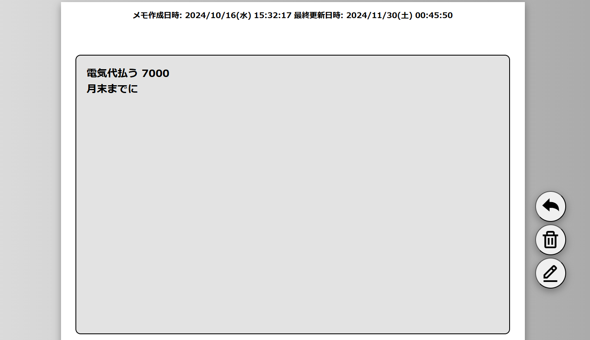

# memo

メモ帳のWebアプリケーションです。
iPhoneのメモ帳をイメージしました。
## 開発環境

- 言語:Java11  JavaScript HTML
- データベース:OracleDatabase19c
- アプリサーバー:tomcat9
- IDE:Eclipse

## 主な機能
- アカウント登録
- メモの追加
- メモの削除
- メモの一括削除
- メモの編集
- 20件を超えるメモはページネーションで表示
- ページスクロール機能
- メモ検索機能(該当するキーワードはハイライトで表示)
- ダークモードとライトモードの2種類切替可能
## スクリーンショット
TOP画面

メモ一覧画面

各メモ詳細画面

検索画面

ダークモード適用時(右上のトグルボタン)

